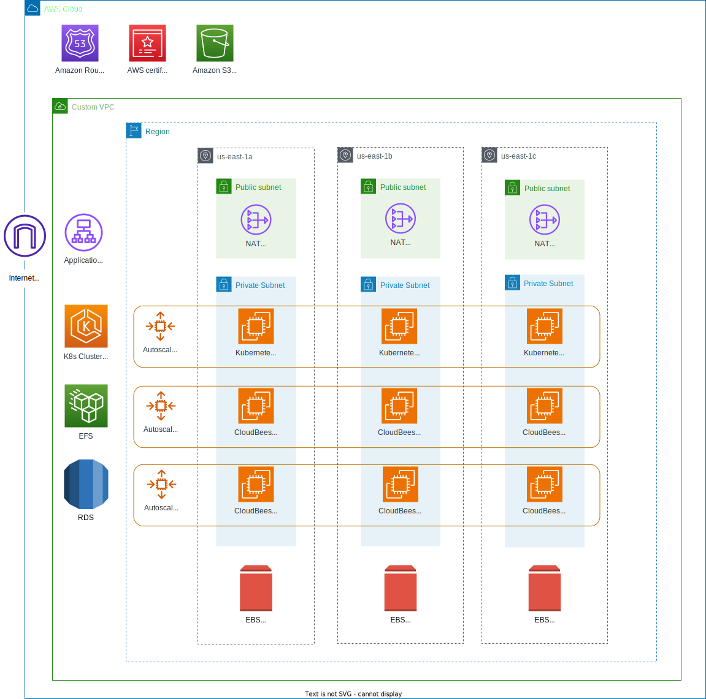

# CloudBees CD Add-on at scale Blueprint

Once you have familiarized yourself with the [Getting Started blueprint](../01-getting-started/README.md), this one presents a scalable architecture and configuration by adding:

- An [RDS](https://aws.amazon.com/rds/) that can be used by Cloudbees CD as database server. 
- An [EFS Drive](https://aws.amazon.com/efs/) that can be used by Cloudbees CD for cluster setup. It is managed by [AWS Backup](https://aws.amazon.com/backup/) for Backup and Restore.
- An [s3 Bucket](https://aws.amazon.com/s3/) to store assets from applications like Velero.
- [EKS Managed node groups](https://docs.aws.amazon.com/eks/latest/userguide/managed-node-groups.html) for Cloudbees CD application.
- The following **[Amazon EKS Addons](https://aws-ia.github.io/terraform-aws-eks-blueprints-addons/main/)**:
  - EKS Managed node groups are watched by [Cluster Autoscaler](https://aws-ia.github.io/terraform-aws-eks-blueprints-addons/main/addons/cluster-autoscaler/) to accomplish [CloudBees auto-scaling nodes on EKS](https://docs.cloudbees.com/docs/cloudbees-ci/latest/cloud-admin-guide/eks-auto-scaling-nodes) on defined EKS Managed node groups.
  - [EFS CSI Driver](https://aws-ia.github.io/terraform-aws-eks-blueprints-addons/main/addons/aws-efs-csi-driver/) to connect EFS Drive to the EKS Cluster.
  - The [Metrics Server](https://aws-ia.github.io/terraform-aws-eks-blueprints-addons/main/addons/metrics-server/) is required by CBCD for Horizontal Pod Autoscaling.
  - [Velero](https://aws-ia.github.io/terraform-aws-eks-blueprints-addons/main/addons/velero/) for Backup and Restore of Kubernetes Resources and Volumen snapshot (EBS compatible only).

> [!TIP]
> A [Resource Group](https://docs.aws.amazon.com/ARG/latest/userguide/resource-groups.html) is added to get a full list with all resources created by this blueprint.

## Architecture



### Kubernetes Cluster


## Terraform Docs

<!-- BEGIN_TF_DOCS -->
### Inputs

| Name | Description | Type | Default | Required |
|------|-------------|------|---------|:--------:|
| host_name | Host name. CloudBees CD Apps is configured to use this host name. | `string` | n/a | yes |
| hosted_zone | Route 53 Hosted Zone. CloudBees CD is configured to use subdomains in this Hosted Zone. | `string` | n/a | yes |
| suffix | Unique suffix to be assigned to all resources | `string` | `""` | no |
| tags | Tags to apply to resources. | `map(string)` | `{}` | no |

### Outputs

| Name | Description |
|------|-------------|
| acm_certificate_arn | ACM certificate ARN |
| aws_backup_efs_protected_resource | AWS Backup Protected Resource descriction for EFS Drive. |
| cbcd_helm | Helm configuration for CloudBees CD Add-on. It is accesible only via state files. |
| cbcd_namespace | Namespace for CloudBees CD Add-on. |
| cbcd_password | command to get the admin password of Cloudbees CD |
| cbcd_url | URL of the CloudBees CD Operations Center for CloudBees CD Add-on. |
| efs_access_points | EFS Access Points. |
| efs_arn | EFS ARN. |
| eks_cluster_arn | EKS cluster ARN |
| kubeconfig_add | Add Kubeconfig to local configuration to access the K8s API. |
| kubeconfig_export | Export KUBECONFIG environment variable to access to access the K8s API. |
| s3_cbcd_arn | cbcd s3 Bucket Arn |
| s3_cbcd_name | cbcd s3 Bucket Name. It is required by Velero for backup |
| velero_backup_on_demand_team_cd | Take an on-demand velero backup from the schedulle for Team CD. |
| velero_backup_schedule_team_cd | Create velero backup schedulle for Team A, deleting existing one (if exists). It can be applied for other controllers using EBS. |
| velero_restore_team_cd | Restore Team A from backup. It can be applicable for rest of schedulle backups. |
| vpc_arn | VPC ID |
<!-- END_TF_DOCS -->

## Deploy

Refer to the [Getting Started Blueprint - Deploy](../01-getting-started/README.md#deploy) section.

Additionally, the following is required:

- Customize your secrets file by copying `flow_db_secrets-values.yml.example` to `flow_db_secrets-values.yml`.
- In the case of using the terraform variable `suffix` for this blueprint, the Amazon `S3 Bucket Access settings` > `S3 Bucket Name` requires to be updated

## Validate

### CBCD
- Once propagation is ready, it is possible to access the CloudBees CD by copying the outcome of the below command in your browser.

  ```sh
  terraform output cbcd_url
  ```
 - Now that you’ve installed CloudBees CD, you’ll want to see your system in action. You will need the initial admin password to log in by run the following command in your terminal:

  ```sh
  eval $(terraform output --raw cbcd_password)
  ```

### Backups and Restores

- For EBS Storage is based on Velero.

  - Create a Velero Backup schedule for Team CD to take regular backups.

    ```sh
    eval $(terraform output --raw velero_backup_schedule_team_cd)
    ```

  - Velero Backup on a specific point in time for Team CD. Note also there is a scheduled backup process in place.

    ```sh
    eval $(terraform output --raw velero_backup_on_demand_team_cd)
    ```

  - Velero Restore process: Make any update on `team-cd` (e.g.: adding some jobs), take a backup including the update, remove the latest update (e.g.: removing the jobs) and then restore it from the last backup as follows

    ```sh
    eval $(terraform output --raw velero_restore_team_cd)
    ```

- EFS Storage is protected in [AWS Backup](https://aws.amazon.com/backup/) with a regular Backup Plan. Additional On-Demand Backup can be created. Restore can be performed and item level (Access Points) or full restore.
 - Protected Resource

   ```sh
   eval $(terraform output --raw aws_backup_efs_protected_resource) | . jq
   ```

 - EFS Access point (they match with CloudBees CI `pvc`)

   ```sh
   eval $(terraform output --raw efs_access_points) | . jq .AccessPoints[].RootDirectory.Path
   ```

## Destroy

Refer to the [Getting Started Blueprint - Destroy](../01-getting-started/README.md#destroy) section.
